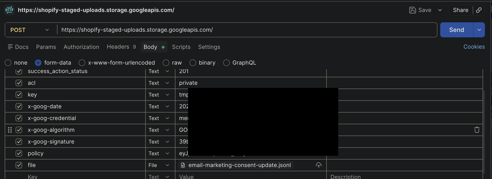

# [ Shopify ] How to Bulk Update Data with Bulk Operations: Email Marketing Consent Example

This article explains how Shopify Bulk Operations work, using bulk edits of email marketing consent as an example.

You will need the following three tools:

- Shopify GraphiQL App
- Postman
- VSCode

Workflow

1. アップロードする顧客のfile(JSONL)を作る
2. アップロード先を作成する
3. 実際にアップロードする
4. bulkOperationを実行する 
5. 実行状況を確認
6. COMPLETEDなら、urlを確認し、errorが出ていないかを確認


1.アップロードする顧客のfile(JSONL)を作る

Step 1: スモールテスト：１顧客だけupdate

```graphql
mutation UpdateCustomerEmailMarketingConsent($input: CustomerEmailMarketingConsentUpdateInput!) {
  customerEmailMarketingConsentUpdate(input: $input) {
    customer {
      defaultEmailAddress {
        emailAddress
        marketingOptInLevel
        marketingState
      }
    }
    userErrors {
      field
      message
    }
  }
}
```

Variables

```json
{
  "input": {
    "customerId": "gid://shopify/Customer/{customer_id}",
    "emailMarketingConsent": {
      "marketingState": "SUBSCRIBED",
      "marketingOptInLevel": "SINGLE_OPT_IN"
    }
  }
}
```


2. 必要な顧客を取得する

```graphql
query GetTargetCustomers($after: String) {
  customers(first: 3, query: "email:*", after: $after) {
    edges {
      node {
        id
        defaultEmailAddress {
          marketingState
        }
      }
    }
    pageInfo {
      hasNextPage
      endCursor
    }
  }
}
```

その顧客情報を使って、JSONLを準備する。

JSONLの名前は、末尾がjsonlで終わっていれば何でも構いません。
email-marketing-consent-update.jsonlとかいう名前で保存して下さい。

```json
{"input":{"customerId":"gid://shopify/Customer/6803302252111","emailMarketingConsent":{"marketingState":"SUBSCRIBED","marketingOptInLevel":"SINGLE_OPT_IN"}}}
{"input":{"customerId":"gid://shopify/Customer/6803310149111","emailMarketingConsent":{"marketingState":"SUBSCRIBED","marketingOptInLevel":"SINGLE_OPT_IN"}}}
{"input":{"customerId":"gid://shopify/Customer/6803317031111","emailMarketingConsent":{"marketingState":"SUBSCRIBED","marketingOptInLevel":"SINGLE_OPT_IN"}}}
```

3. GraphQLを実行し、アップロード先を作成する

```graphql
mutation CreateStagedUploadTarget {
  stagedUploadsCreate(input: [
    {
      resource: BULK_MUTATION_VARIABLES,
      filename: "email-marketing-consent-update.jsonl",
      mimeType: "text/jsonl",
      httpMethod: POST
    }
  ]) {
    stagedTargets {
      url
      resourceUrl
      parameters {
        name
        value
      }
    }
    userErrors {
      field
      message
    }
  }
}
```

レスポンス

```json
{
  "data": {
    "stagedUploadsCreate": {
      "stagedTargets": [
        {
          "url": "https://shopify-staged-uploads.storage.googleapis.com/",
          "resourceUrl": "https://shopify-staged-uploads.storage.googleapis.com/",
          "parameters": [
            {
              "name": "Content-Type",
              "value": "text/jsonl"
            },
            {
              "name": "success_action_status",
              "value": "201"
            },
            {
              "name": "acl",
              "value": "private"
            },
            {
              "name": "key",
              "value": "tmp/64823558111/bulk/0dc37105-375a-4df1-b405-765f3be15111/email-marketing-consent-update.jsonl"
            },
            {
              "name": "x-goog-date",
              "value": "20260425T021333Z"
            },
            {
              "name": "x-goog-credential",
              "value": "merchant-assets@shopify-tiers.iam.gserviceaccount.com/20260411/auto/storage/goog4_request"
            },
            {
              "name": "x-goog-algorithm",
              "value": "GOOG4-RSA-SHA256"
            },
            {
              "name": "x-goog-signature",
              "value": "{your_signature}"
            },
            {
              "name": "policy",
              "value": "{your_value}"
            }
          ]
        }
      ],
      "userErrors": []
    }
  },
  "extensions": {
    "cost": {
      "requestedQueryCost": 11,
      "actualQueryCost": 11,
      "throttleStatus": {
        "maximumAvailable": 20000,
        "currentlyAvailable": 19989,
        "restoreRate": 1000
      }
    }
  }
}
```

4. postmanで実際にuploadを実行します。



postmanでpostして返ってきた結果

```xml
<?xml version='1.0' encoding='UTF-8'?>
  <PostResponse>
    <Location>https://storage.googleapis.com/shopify-staged-uploads/tmp/64823558111/bulk/0dc37105-375a-4df1-b405-765f3be15cb8/email-marketing-consent-update.jsonl</Location>
    <Bucket>shopify-staged-uploads</Bucket>
    <Key>tmp/{your_path}/email-marketing-consent-update.jsonl</Key>
    <ETag>"5711744ecba9e35af730667c956ca111"</ETag>
  </PostResponse>
```

1. upload先に対して、bulkOperationを実行する

```graphql
  mutation RunBulkEmailMarketingConsentUpdate($stagedUploadPath: String!) {
  bulkOperationRunMutation(
    stagedUploadPath: $stagedUploadPath
    mutation: """
      mutation call($input: CustomerEmailMarketingConsentUpdateInput!) {
        customerEmailMarketingConsentUpdate(input: $input) {
          customer {
            id
            email
          }
          userErrors {
            field
            message
          }
        }
      }
    """
  ) {
    bulkOperation {
      id
      status
    }
    userErrors {
      field
      message
    }
  }
}
```

変数

```json
{
  "stagedUploadPath": "tmp/{your_path}/email-marketing-consent-update.jsonl"
}
```

実行結果

```json
{
  "data": {
    "bulkOperationRunMutation": {
      "bulkOperation": {
        "id": "gid://shopify/BulkOperation/7726780181111",
        "status": "CREATED"
      },
      "userErrors": []
    }
  },
  "extensions": {
    "cost": {
      "requestedQueryCost": 10,
      "actualQueryCost": 10,
      "throttleStatus": {
        "maximumAvailable": 20000,
        "currentlyAvailable": 19990,
        "restoreRate": 1000
      }
    }
  }
}
```

5.実行状況を確認

```graphql
query CheckBulkOperation($id: ID!) {
  bulkOperation(id: $id) {
    id
    status
    errorCode
    objectCount
    url
    partialDataUrl
  }
}
```

変数

```json
{
  "id": "gid://shopify/BulkOperation/7726780181111"
}
```

pollingのレスポンス

```json
{
  "data": {
    "bulkOperation": {
      "id": "gid://shopify/BulkOperation/7726780181111",
      "status": "COMPLETED",
      "errorCode": null,
      "objectCount": "3",
      "url": "https://storage.googleapis.com/shopify-tiers-assets-prod-us-east1/bulk-operation-outputs/{your_url}",
      "partialDataUrl": null
    }
  },
  "extensions": {
    "cost": {
      "requestedQueryCost": 1,
      "actualQueryCost": 1,
      "throttleStatus": {
        "maximumAvailable": 20000,
        "currentlyAvailable": 19999,
        "restoreRate": 1000
      }
    }
  }
}
```

6.COMPLETEDなら、urlを確認し、errorが出ていないかを確認

返ってくるpollingのレスポンスのurlには、結果のfileがあります。そこでerrorがあったら、もう一度、
stagedUploadsCreateの実行からやり直しましょう。