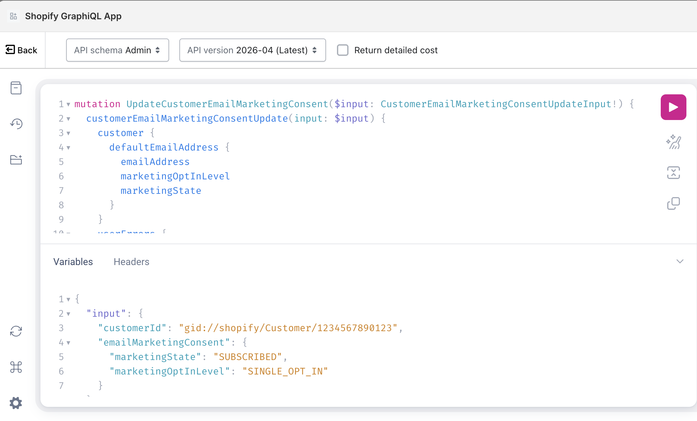

# Shopify Bulk Operations Setup

This article explains how Shopify Bulk Operations work, using bulk edits of email marketing consent as an example.

You will need the following three tools:
- Shopify GraphiQL App
- Postman
- VSCode

Workflow

A. Small test
B. Medium to large rollout
 1. Select the target customers with a query
 2. Export or identify their IDs
 3. Prepare one JSONL line per customer
 4. Run a bulk mutation
 5. Check the result and retry failures

1. First, let's get set up using GraphiQL.

Step 1: Small test: Update one customer

```
mutation UpdateCustomerEmailMarketingConsent($input: CustomerEmailMarketingConsentUpdateInput!) {
  customerEmailMarketingConsentUpdate(input: $input) {
    customer {
      defaultEmailAddress {
        emailAddress
        marketingOptInLevel
        marketingState
      }
    }
    userErrors {
      field
      message
    }
  }
}
```

Variables
```
{
  "input": {
    "customerId": "gid://shopify/Customer/{customer_id}",
    "emailMarketingConsent": {
      "marketingState": "SUBSCRIBED",
      "marketingOptInLevel": "SINGLE_OPT_IN"
    }
  }
}
```


